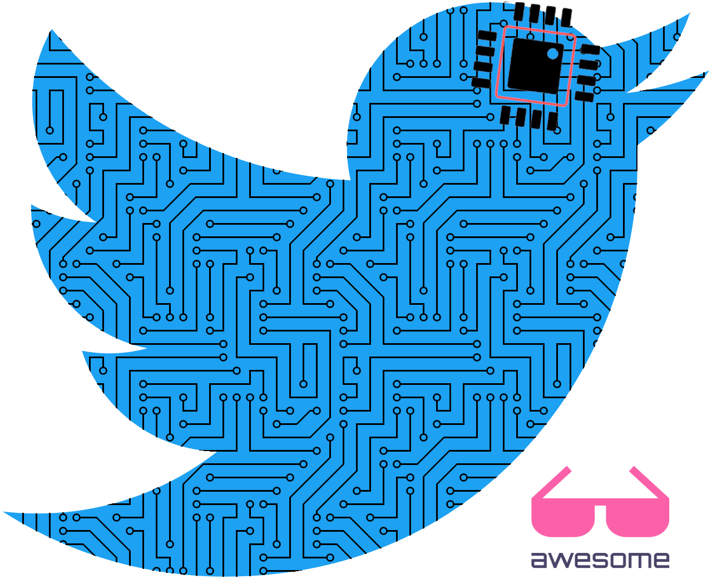

    
   

# Awesome Embedded and IoT on Twitter 

> A curated list of accounts to follow on Twitter for enjoyable and valuable Embedded Systems and IoT content.

Isn't the goal of Twitter spreading information to keep you up to date? :telescope:

Even with technical news and insights about Embedded Systems and IoT: I will try to update this list daily with accounts whose tweets I retweet and comment [here](https://twitter.com/iotwithit).

You should know, Twitter is [the secret hacker forum](https://www.youtube.com/watch?v=VCwiZ2dh17Q).

## Contents

- [People](#people)
- [Companies and Foundations](#companies-and-foundations)
- [Magazines and Others](#magazines-and-others)

## People

- [Lup Yuen Lee](https://twitter.com/MisterTechBlog) - Techie and Educator in IoT.
- [Mohammad Afaneh](https://twitter.com/m_afaneh) - BLE Developer, Educator and Author.

## Companies and Foundations

- [Nordic Semiconductor](https://twitter.com/NordicTweets) - Short range wireless and low power cellular IoT specialist.

## Magazines and Others

- [Electronic Design](https://twitter.com/ElectronicDesgn) - Source for emerging technologies for design solutions.
- [Embedded Computing Design](https://twitter.com/embedded_comp) - Blogs, news & articles on IIoT, IoT, automotive.

## Contribute

Contributions welcome! Read the [contribution guidelines](contributing.md) first.

## License

To the extent possible under law, Lorenzo Rizzello has waived all copyright and
related or neighboring rights to this work.
